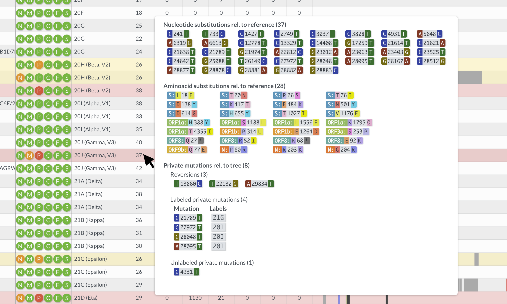

Nextclade web is available online at [clades.nextstrain.org](https://clades.nextstrain.org). This is the easiest way of using Nextclade and is the recommended way to get started.

Drag a fasta file onto the "upload" box, provide a url or paste sequence data directly into the text box. The sequences will then be analyzed right in your browser - data never leaves your computer (i.e. no actual "upload" is happening). Since your computer is doing the computational work rather than a remote server, it is advisable to analyze at most a few hundred of sequences at a time, depending on yor hardware.

Power users might want to switch to "Advanced mode" in order to get access to more configuration. This mode is equivalent to using the Nextclade command-line tool and accepts the same input files (see "inputs" section) <!--- Need to link to CLI docs here -->.

The simple mode ("non-advanced") of the web application currently only supports SARS-CoV-2 sequences, but we are extending the tool to influenza and hopefully other pathogens in the future.

## Getting started

The quickest way to explore Nextclade web is to open [clades.nextstrain.org](https://clades.nextstrain.org) in your browser. We recommend you use Firefox or a Chromium based browser (Chrome, Edge, Brave, Opera, etc.), since these are the browser we officially support. Then click on "Show me an example", if you don't want to upload your own SARS-CoV-2 FASTA file.  

If you decide to use your own data, you can choose between a file upload, a link to a file on the internet or simply pate from a clipboard. For now, only SARS-CoV-2 sequences are supported.

## Analysis

Nextclade analyzes your sequences locally in your browser. That means, sequences never leave your computer, ensuring full privacy by design.

The analysis pipeline comprises the following steps:
1. Alignment: Sequences are aligned to the reference genome using its custom Nextalign alignment algorithm.
2. Translation: Nucleotide sequences are translated into amino acid sequences.
3. Mutation calling: Nucleotide and amino acid changes are identified
4. PCR primer changes are computed
5. Phylogenetic placement: Sequences are placed on a reference tree, clades assigned to nearest neighbour.
6. Quality control: Quality control metrics are calculated

You can get a quick overview of the results screen in the screenshot below:

### QC metrics

Nextclade implements a variety of quality control metrics to quickly spot problems in your sequencing/assembly pipeline. You can get a quick idea which of your sequences are having problems by sorting the results table from bad to good (click on the upper arrow in the column QC). Bad sequences are colored red, mediocre ones yellow and good ones white. You can view detailed results of the QC metrics by hovering your mouse over a sequences QC entry:

Every icon corresponds to a different metric.

<!--- TODO: Describe metrics -->

### Table data

Nextclade automatically infers the (probable) clade a sequence belongs to and displays the result in the table. Clades are determined by identifying the clade of the neares neighbour on a reference tree. 

The result table further displays for each sequence: 
- "Mut.": number of mutations with respect to the root of the reference tree
- "non-ACGTN": number of ambiguous nucleotides that are not *N*
- "Ns": number of missing nucleotides indicated by *N*
- "Gaps": number of nucleotides that are deleted with respect to the reference sequence
- "Ins.": number of nucleotides that are inserted with respect to the reference sequence

Hovering over table entries reveals more detailed information. For example, hovering over the number of mutations reveals which nucleotides and aminoacids have changed with respect to the reference. Changes in bases that are used by common primers are also displayed.

### Alignment viewer

To the right of the table you can see the alignment with mutations and regions with missing data highlighted in color. You can quickly check how segments of missing data are distributed on the genome - whether it's a few big chunks clustering in one area or many small missing segments.

You can zoom into a gene by clicking on the respective gene at the bottom.

In sequence view, one can observe mutations in a particular gene. One of Nextclade's strengths is that nucleotide and amino acid changes are visualised in the tooltip in a codon-aware way as you can see in the example below

### Tree

### Download data

### Custom upload

