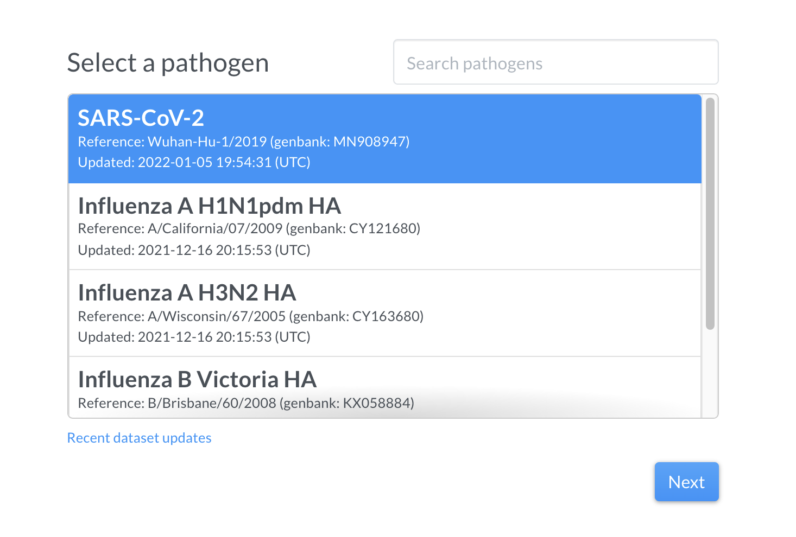
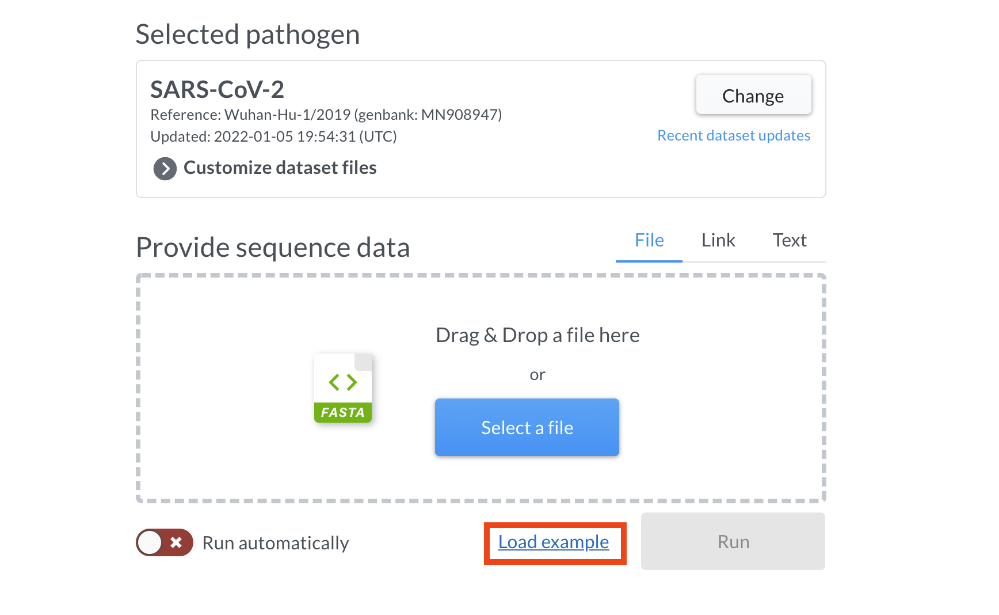
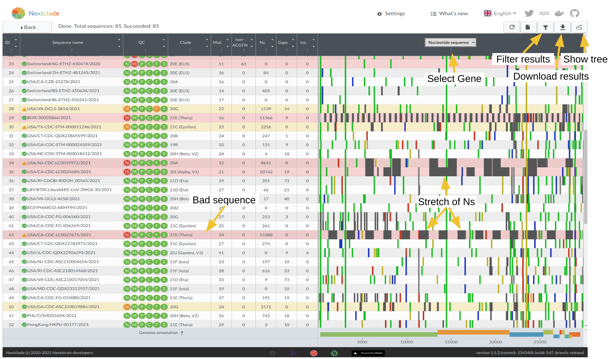
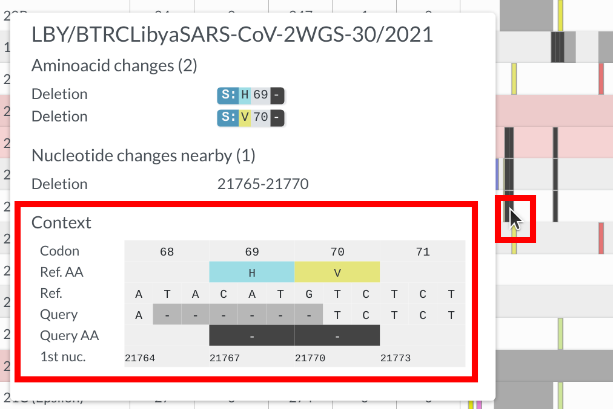

# Nextclade Web

**Nextclade Web** is available online at [clades.nextstrain.org](https://clades.nextstrain.org). This is the easiest way of using Nextclade and is the recommended way to get started.

The application accepts sequence data in [FASTA](https://en.wikipedia.org/wiki/FASTA_format) format, performs alignment, mutation calling, clade assignment, phylogenetic placement and quality control checks and displays the results in tabular form as well as in the form of the phylogenetic tree. The results can also be downloaded as files, for further review and analysis.

Nextclade is built for quick feedback. The entire analysis, depending on the number of sequences to be processed, takes from a few seconds to a few minutes.

Despite being made in the form of a website, Nextclade runs its processing entirely offline. The algorithms are executed within your browser and the data never leaves your computer (i.e. no data upload is happening). Nextclade however still needs internet access to download its own modules and dataset files.

## Getting started

Open [clades.nextstrain.org](https://clades.nextstrain.org) in your browser.

> ⚠️ For the best experience we recommend using latest versions of Firefox or Chrome web browsers on a desktop computer or a laptop with a 1080p display or above.
>
> Using Safari browser is not recommended due to its poor support of required web technologies.

For a demonstration of capabilities of Nextclade, select the virus you want to analyse and click `Next`.



To see Nextclade in action without your own sequences, click on `Load example`, then `Run`.



In order to run the analysis on your own data, prepare a [FASTA](https://en.wikipedia.org/wiki/FASTA_format) file with your sequences, drag & drop it onto the upload area (or use the file picker) and click `Run`.
You will be redirected to the results page.

Power users might want to click **Customize dataset files** in order to get access to more configuration. This mode is equivalent to using the [Nextclade CLI](nextclade-cli), and accepts the same input files.

> 💡 There is a number of options of providing input data to Nextclade, including:
>
> - Drag & Drop a file onto the "upload" area
> - Picking a file from computer storage: click `Select a file`
> - Providing a URL (link) to a file publicly available on the internet: click the `Link` tab
> - Pasting sequence data from clipboard: click the `Paste` tab
> - Providing a URL using [URL parameters](#url-parameters)

## Analysis

Nextclade analyzes your sequences locally in your browser. That means, sequences never leave your computer, ensuring full privacy by design.

> ⚠️ Since your computer is doing all the computational work (rather than a remote server), it is advisable to analyze at most a few hundred of sequences at a time, depending on your computer hardware. Nextclade leverages all processor cores available on your computer and might require large amounts of system memory to operate. For large-scale analysis (thousands to millions of sequences) you might want to try [Nextclade CLI](nextclade-cli) instead.

The analysis pipeline comprises the following steps:

1. Sequence alignment: Sequences are aligned to the reference genome using our custom Nextalign alignment algorithm.
2. Translation: Nucleotide sequences are translated into amino acid sequences.
3. Mutation calling: Nucleotide and amino acid changes are identified
4. Detection of PCR primer changes
5. Phylogenetic placement: Sequences are placed on a reference tree, private mutations analyzed
6. Clade assignment: Clades are taken from the parent node on the tree
7. Quality Control (QC): Quality control metrics are calculated

See [Algorithm](algorithm) section for more details.

You can get a quick overview of the results screen in the screenshot below:


### QC metrics

Nextclade implements a variety of quality control metrics to quickly spot problems in your sequencing/assembly pipeline. You can get a quick idea which of your sequences are having problems by sorting the results table from bad to good (click on the upper arrow in the column "QC"). Bad sequences are colored red, mediocre ones yellow and good ones white. You can view detailed results of the QC metrics by hovering your mouse over a sequences QC entry:


Every icon corresponds to a different metric. See [Quality control](algorithm/07-quality-control) section for the detailed explanation of QC metrics.


### Table data

Nextclade automatically infers the (probable) clade a sequence belongs to and displays the result in the table. Clades are determined by identifying the clade of the nearest neighbour on a reference tree.

The result table further displays for each sequence:

- "Mut.": number of mutations with respect to the root of the reference tree
- "non-ACGTN": number of ambiguous nucleotides that are not *N*
- "Ns": number of missing nucleotides indicated by *N*
- "Gaps": number of nucleotides that are deleted with respect to the reference sequence
- "Ins.": number of nucleotides that are inserted with respect to the reference sequence
- "FS": Number of uncommon frame shifts (total number, including common frame shifts are in parentheses)
- "SC": Number of uncommon premature stop codons (total number, including common premature stops are in parentheses)

Hovering over table entries reveals more detailed information. For example, hovering over the number of mutations reveals which nucleotides and aminoacids have changed with respect to the reference, as well as so-called _private_ mutations (mutations that differ from the nearest neighbor on the reference tree), which are are split into:

- Reversions: mutations back to reference, often a sign of sequencing problems
- Labeled: Mutations that are known, for example because they occur often in a clade. If multiple labeled mutations from the same clade appear, it is a sign of contamination, co-infection or recombination.
- Unlabeled: Mutations that are neither reversions nor labeled.

In the screenshot below, the mouse hovers over a _20J (Gamma)_ sequence. The tooltip shows there are 3 reversion and 4 labeled mutations, indicative of sequence quality problems, potentially a contamination with _20I (Alpha)_.


### Alignment viewer

To the right of the table you can see the alignment with mutations and regions with missing data highlighted in grey. You can quickly check how segments of missing data are distributed on the genome - whether it's a few big chunks clustering in one area or many small missing segments.


You can zoom into a gene by clicking on the respective gene at the bottom, or selecting the gene of interest from the dropdown at the top.


In sequence view, one can observe mutations in a particular gene. One of Nextclade's strengths is that nucleotide and amino acid changes are visualised in the tooltip in a codon-aware way, as you can see in the example below



### Tree
In order to assign clades to sequences, Nextclade [places](algorithm/05-phylogenetic-placement) all new sequences on a a reference tree. You can view the resulting tree by clicking on the tree icon at the top right.

The tree is visualized by [Nextstrain Auspice](https://docs.nextstrain.org/projects/auspice/en/stable/). By default, only your uploaded sequences are highlighted.

One limitation to be aware of is that new sequences are placed one by one on the reference tree. Thus, no common internal nodes of new sequences are placed on the tree. If you are interested in seeing ancestral relationships between your sequences, we recommend you use [Usher](https://genome.ucsc.edu/cgi-bin/hgPhyloPlace).


### Download data

Once Nextclade has finished its analysis, you can download the results in a variety of formats by clicking the download icon at the top right:


- `nextclade.{json,tsv,csv}`: Detailed results in either `json`, `tsv` or `csv` format, containing most results such as clades, mutations, QC metrics and more.
- `nextclade.auspice.json`: Phylogenetic reference tree including new sequences in `auspice.json` format for viewing with Nextstrain Auspice, for example at auspice.us
- `nextclade.aligned.fasta`: A `fasta` file containing alignments of all uploaded sequences
- `nextclade.peptides.fasta.zip`: A `zipped` folder of translated and aligned amino acid sequences in `fasta` format
- `nextclade.insertions.csv`: A `csv` file containing all insertions that have been stripped from the aligned sequences (including insertions in the alignment would cause deletions to appear in the reference sequence).
- `nextclade.errors.csv`: A file containing all errors and warnings that occurred during the analysis, like genes that failed to be translated
- `nextclade.zip`: A `zip` file containing all files mentioned above

### Advanced mode

You can use a custom dataset in Nextclade web through the advanced mode. The same input files as for Nextclade CLI can be specified, see [input files](input-files) for more details. Click on `Customize dataset files` to open advanced mode:


The selected dataset, for example `SARS-CoV-2` is used as the default for any input file and overwritten by user supplied files.

You can provide files by drag and drop, by providing a web link or copying it into a text box:


### URL parameters

Input files can be specified in the URL parameters. The name of the parameters match the corresponding `--input*`
flags of [Nextclade CLI](nextclade-cli) and flags of the `dataset get` command for datasets.

You can learn more about input files and datasets in sections: [Input files](input-files), and [Nextclade datasets](datasets).

If an `input-fasta` URL parameter is provided, Nextclade Web automatically starts the analysis after all input and dataset files are downloaded.

All parameters are optional.

| URL parameter          | Meaning                                                                                             |
| ---------------------- | --------------------------------------------------------------------------------------------------- |
| input-fasta            | URL to a fasta file containing query sequences. If provided, the analysis will start automatically. |
| input-root-seq         | URL to a fasta file containing reference (root) sequence.                                           |
| input-tree             | URL to a Auspice JSON v2 file containing reference tree.                                            |
| input-pcr-primers      | URL to a CSV file containing PCR primers.                                                           |
| input-qc-config        | URL to a JSON file containing QC onfiguration.                                                      |
| input-gene-map         | URL to a GFF3 file containing gene map.                                                             |
| input-virus-properties | URL to a JSON file containing labeled genotypes (`virusProperties.json`)                            |
| dataset-name           | Safe name of the dataset to use. Examples: `sars-cov-2`, `flu_h3n2_ha`                              |
| dataset-reference      | Accession of the reference sequence of the dataset to use: Examples: `MN908947`, `CY034116`.        |
| dataset-tag            | Version tag of the dataset to use.                                                                  |

For example, the file with input sequences hosted at `https://example.com/sequences.fasta` can be specified with:

```url
https://clades.nextstrain.org?dataset-name=sars-cov-2
    &input-fasta=https://example.com/sequences.fasta
```

(the newlines and the indentation are added here for readability, they should not be present in the URL)

In this case, Nextclade will download the latest SARS-CoV-2 dataset and the provided `fasta` file, and will automatically start the analysis. Real example:

> [https://clades.nextstrain.org?dataset-name=sars-cov-2&input-fasta=https://data.clades.nextstrain.org/datasets/sars-cov-2/references/MN908947/versions/2022-01-05T19:54:31Z/files/sequences.fasta](https://clades.nextstrain.org?dataset-name=sars-cov-2&input-fasta=https://data.clades.nextstrain.org/datasets/sars-cov-2/references/MN908947/versions/2022-01-05T19:54:31Z/files/sequences.fasta)

Multiple files can be specified, for example the sequences and the reference tree:

```url
https://clades.nextstrain.org
    ?dataset-name=sars-cov-2
    &input-fasta=https://example.com/sequences.fasta
    &input-tree=https://example.com/tree.json
```

Another dataset can be specified with `dataset-name`:

```url
https://clades.nextstrain.org
    ?dataset-name=flu_h3n2_ha
    &input-fasta=https://example.com/flu_sequences.fasta
```

Another dataset based on a particular reference sequence can be specified with a combination of `dataset-name` and `dataset-reference`:

```url
https://clades.nextstrain.org
    ?dataset-name=flu_h3n2_ha
    &dataset-reference=CY034116
    &input-fasta=https://example.com/flu_sequences.fasta
```

> 💡 Nextclade is a client-side-only, single-page web application, hosted on a static server. We do not set any usage limits for the analyses triggered. Note that all the computation will happen on the end-user machine.

> ⚠️The linked resources should be available for fetching by a web browser on the client machine. Make sure [Cross-Origin Resource Sharing (CORS)](https://developer.mozilla.org/en-US/docs/Web/HTTP/CORS) is enabled on your file server as well as that all required authentication (if any) is included into the file URL itself.

> ⚠️The URLs might get quite complex, so don't forget to [encode the special characters](https://en.wikipedia.org/wiki/Percent-encoding), to keep the URLs valid.

## Performance tips

Nextclade algorithms are computationally expensive and require a lot of CPU cycles and system memory (RAM). All this computational work runs on your computer, in the web browser.

For the best experience and performance, it is advised to run Nextclade in one of the latest versions of Firefox or Chrome web browsers, as they are known for the fastest and the most spec-compliant implementations of the web technologies that Nextclade uses.

Browser extensions, such as ad blockers, can interfere with Nextclade software modules and may cause slowdown, excessive memory consumption and crashes. Nextclade does not serve ads. Try to remove these extensions or to disable them selectively for Nextclade website.

For optimal performance, before running Nextclade, close unused applications and browser tabs, especially tabs with extra copies of Nextclade, in order to free up the system memory they are occupying.

You can also try to tune the performance by increasing or decreasing the number of CPU threads in the "Settings" window. This option tells Nextclade how many processing jobs it is allowed to run in parallel. More threads will consume more memory, and will make startup process longer, but will make the analysis faster in case there are many sequences to process. Less threads will speedup the startup, and decrease memory consumption, but will make the analysis slower.

In case of any problems, try to run Nextclade in a fresh private/incognito browser window, with no extensions enabled, and where Nextclade is the only tab.


## What's next?

Congratulations, You have learned how to use Nextclade Web!

Going further, you might want to learn about the science behind the Nextclade internals in the [Algorithm](algorithm) section.

For more advanced use-cases, check out [Nextclade CLI](nextclade-cli.md).

Nextclade is an open-source project. We welcome ideas and contributions. Head to our [GitHub repository](https://github.com/nextstrain/nextclade) if you want to obtain the source code, open bug reports or suggest features.
